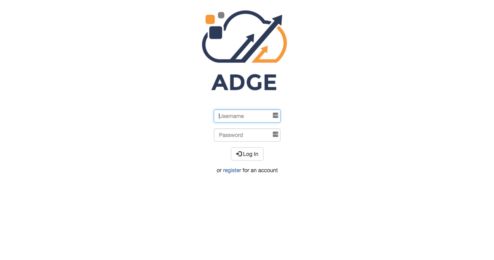

# Stock-Trader
## Play the stock market with virtual money

### This project was created as part of Harvaard's online course CS50

***

This web app pulls realworld financial data from Yahoo.com which allows users to buy and trade 
stocks, and manage a portfolio over time. 

The site was built with C and PHP in the backend, and HTML, and CSS with Bootstrap in the front end. 

